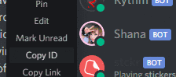

# :wave: [UAV discord bot](https://github.com/Hantasmagoria/UnrehearsedAntihistoricalValedictorian) :egg:

> Discord bot catered for the needs of the Invictus discord server

## Table of Contents

- [Installation](#installation)
- [Current Features](#current-features)
- [Usage](#usage)
- [Roadmap](#roadmap)

## Installation

UAV requires Node.js to run.

create a config.json with required values:

```
{
  "prefix": ">",
  "BOT_YOUTUBE_TOKEN": "<insert BOT_YOUTUBE_TOKEN>",
  "BOT_TOKEN": "<insert BOT_TOKEN>"
}
```

Install the dependencies and start the bot.

```
cd UnrehearsedAntihistoricalValedictorian
npm install
npm start
```

## Current Features

- Quoting a message within a server using message ID

## Usage



### `>quote`

> \>quote [messageID]

(developer mode required)

## Roadmap

~- Allow quote function to be used in all channels within server~

- Music function
- Google web and image search.
- Keyword/user logger and notifier. Get notified when keywords you specified are said in any of your server or follow users and get notified when they send a message (with a cooldown). Useful to track someone or see if someone mentioned your name or your favorite show/book/whatever else keywords and you want to stalk— I mean, talk to them about it.
- Save image/gif/webm dumps (urls or attachments) in channels quickly to your computer (checks for duplicates as well).
- Detailed image/gif source finder using sauce.nao
- Add custom commands/reactions. Sample commands included. Can be used as macros for other commands as well.
- Custom embeds.
- Get detailed information about a server and all of its members.
- Purge the last n messages you sent in a channel.
- Quick commands so you can post pointless stuff as fast as possible like `lenny`, `shrug`, `flip`, `unflip`, and `comeatmebro`
- Various other misc commands like creating strawpolls, embeding text, server/user info commands, and more.
